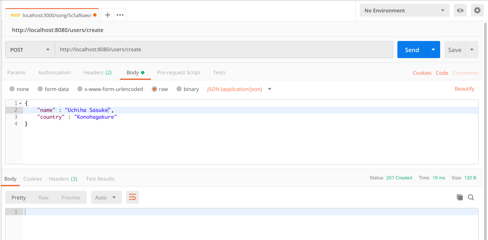
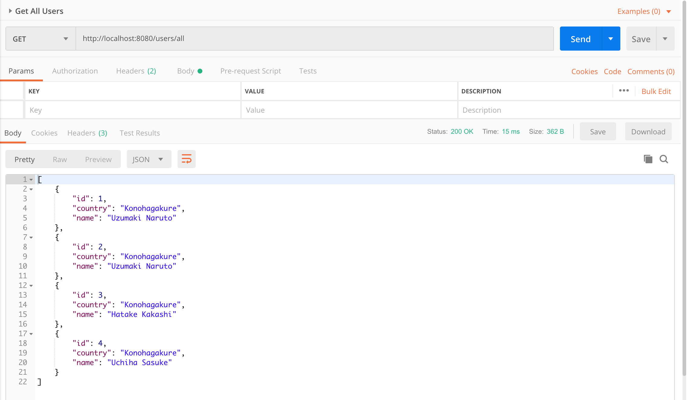
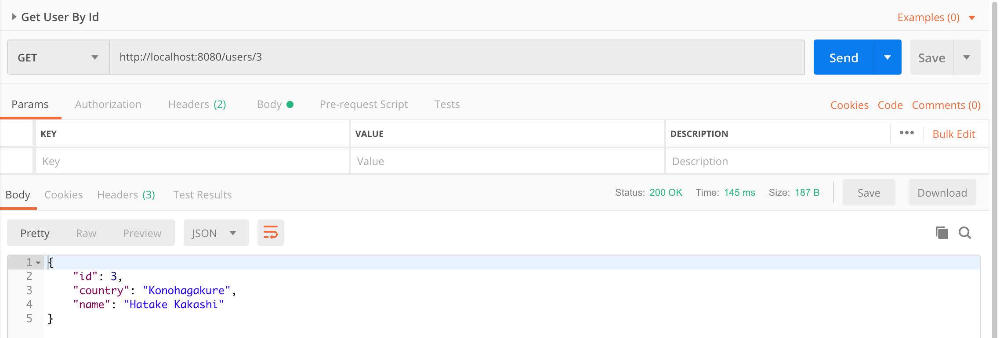
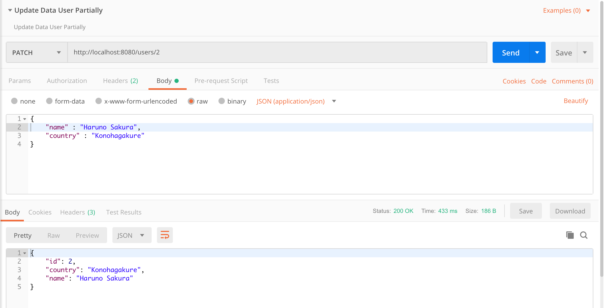
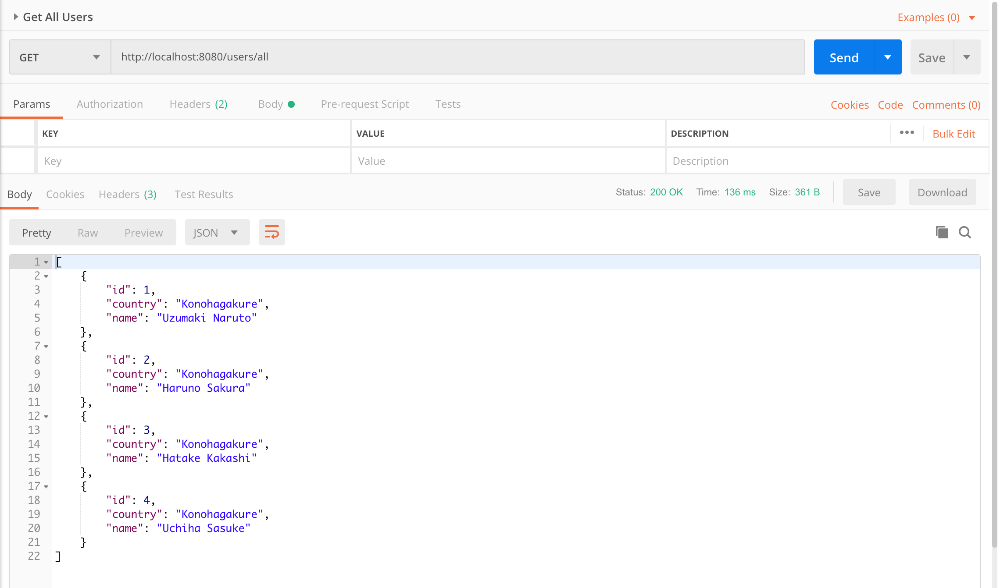
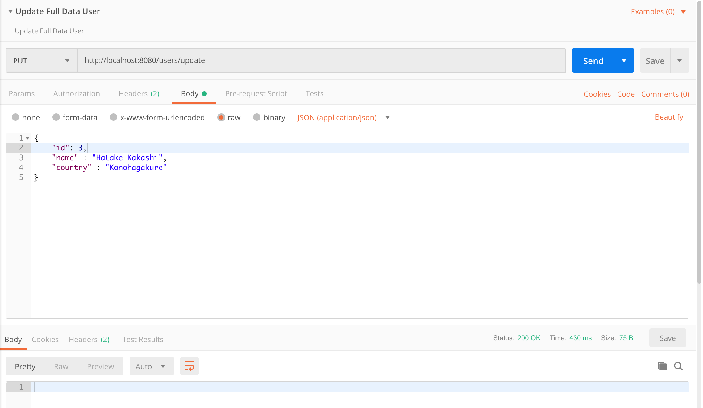
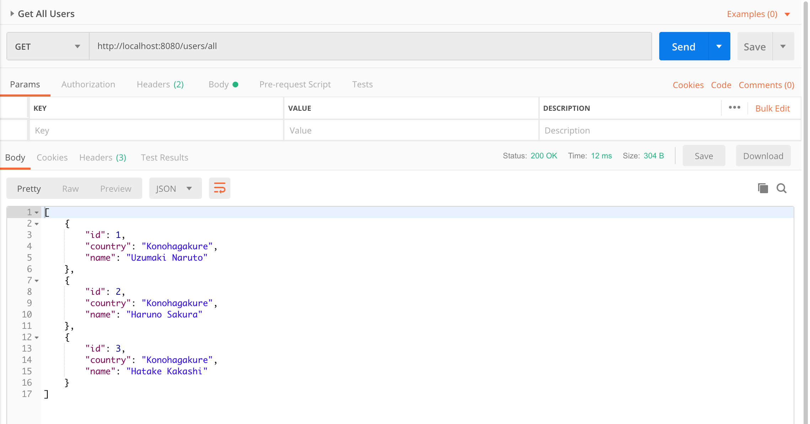
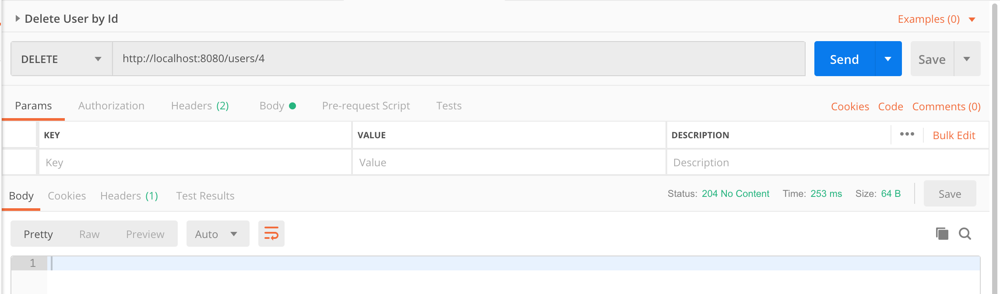

# springboot-jpa-mysql-example

### Thing to do to run locally:
1. Clone repo : 
    ```
    git clone https://github.com/hendisantika/springboot-jpa-mysql-example.git
    ```
2. Go to the folder : 
    ```
    cd springboot-jpa-mysql-example
    ```
3. Run the app :
    ```
    mvn clean spring-boot:run
    ```

### REST Request sample:

#### Add New User



#### List All Users



#### Get User By Id



#### Update Data user partially





#### Update Data user fully





#### Delete data user by Id


